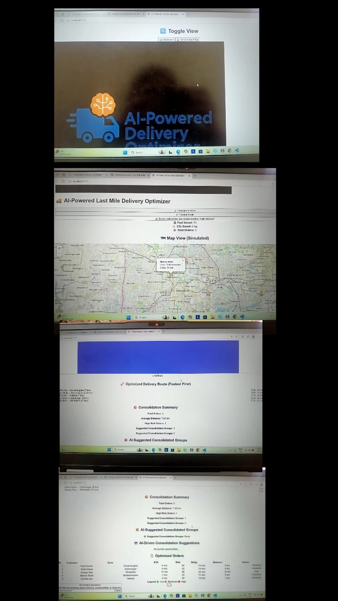
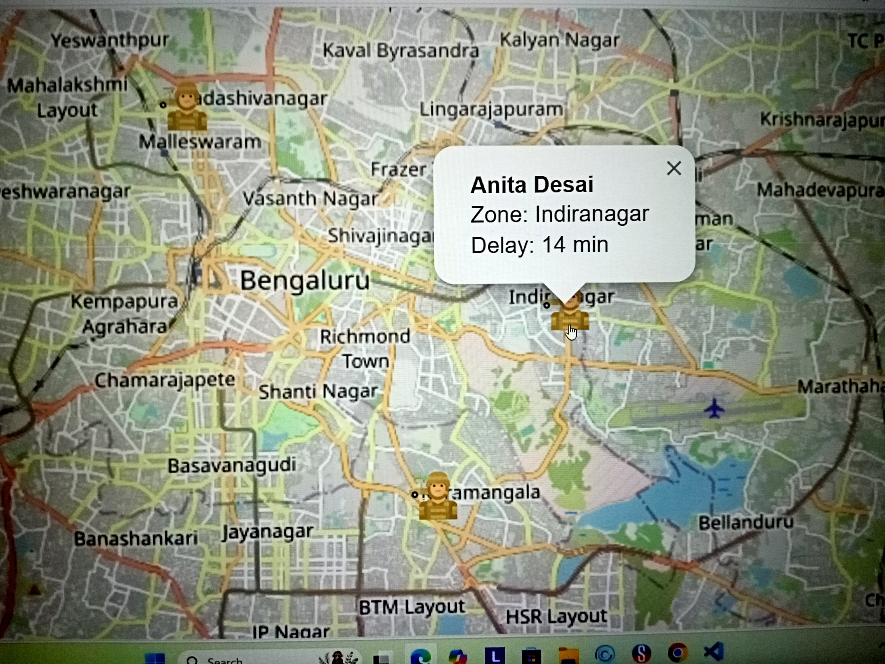
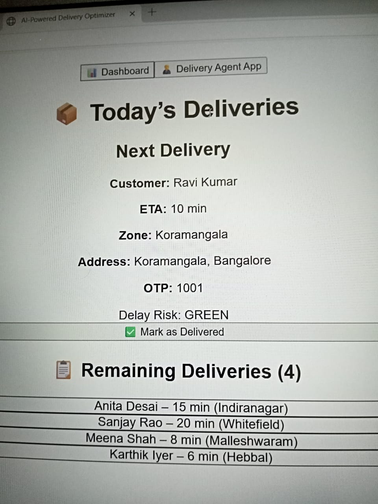

# Delivery Optimizer AI

Production-style last-mile delivery optimization platform combining Machine Learning, Route Optimization, and a modern React dashboard.

The system predicts delivery ETAs using an XGBoost regression model, optimizes delivery routes using Google OR-Tools, and exposes these capabilities through a FastAPI REST API consumed by a React frontend.

The project demonstrates the integration of machine learning, optimization algorithms, backend engineering, testing, and cloud deployment into a single application.

## Live Deployment

| Component | URL |
|----------|-----|
| Frontend | https://YOUR-VERCEL-URL.vercel.app |
| Backend API | https://YOUR-RENDER-URL.onrender.com |
| API Documentation | https://YOUR-RENDER-URL.onrender.com/docs |
| Health Endpoint | https://YOUR-RENDER-URL.onrender.com/health |

Replace the placeholder URLs after deployment.

## Architecture

```text
                     React + Vite Frontend
                              │
                         REST API Calls
                              │
                              ▼
                 FastAPI Delivery Intelligence API
          ┌───────────────────┼───────────────────┐
          │                   │                   │
          ▼                   ▼                   ▼
  ETA Prediction      Route Optimization    Business Rules
     XGBoost           Google OR-Tools       Rule Engine
```

The frontend communicates exclusively with the FastAPI backend through REST APIs.

The backend separates machine learning inference, optimization algorithms, and business logic into independent components, making the system easier to extend, maintain, and deploy.

## Technology Stack

### Frontend

- React
- Vite
- JavaScript
- Tailwind CSS
- Leaflet Maps

### Backend

- Python 3.12
- FastAPI
- Pydantic

### Machine Learning

- XGBoost
- Scikit-Learn
- Pandas
- NumPy
- Joblib

### Optimization

- Google OR-Tools

### Testing

- Pytest

### CI

- GitHub Actions

### Deployment

- Vercel
- Render
- Docker

## Features

### ETA Prediction

- XGBoost regression model
- Batch prediction endpoint
- Reproducible training pipeline
- Feature engineering pipeline
- Serialized Scikit-Learn preprocessing pipeline
- Model persistence using Joblib

### Route Optimization

- Vehicle route optimization
- Capacity-constrained routing
- Multi-stop sequencing
- Distance minimization
- Google OR-Tools integration

### Dashboard

- Interactive operations dashboard
- Fleet overview
- Delivery tracking
- GPS visualization
- Sustainability analytics
- Delay prediction
- Emergency mode
- Festival mode
- Offline support

### Backend

- FastAPI REST API
- Automatic OpenAPI documentation
- Input validation using Pydantic
- Health monitoring endpoint
- Structured API responses
- Modular architecture

## Screenshots

### Dashboard



### Delivery Map



### Delivery Agent



## AI Components

| Capability | Implementation | Category |
|------------|---------------|----------|
| ETA Prediction | XGBoost Regression | Machine Learning |
| Route Optimization | Google OR-Tools | Operations Research |
| Delay Alerts | Rule Engine | Business Logic |
| Emergency Mode | Rule Engine | Business Logic |
| Festival Mode | Rule Engine | Business Logic |

The ETA prediction model and route optimization engine are intentionally implemented as separate services.

Machine learning is used only where historical data improves prediction quality. Rule-based business logic remains isolated from the predictive model, while route optimization is solved using Google OR-Tools.

This separation improves maintainability, testing, and future extensibility.

## Model Performance

The ETA prediction model was trained using the [Food Delivery Time Prediction Case Study dataset](https://www.kaggle.com/datasets/gauravmalik26/food-delivery-dataset) from Kaggle.

Evaluation was performed on a held-out 20% test set.

| Metric | Value |
|--------|------:|
| Mean Absolute Error (MAE) | **4.922 minutes** |
| Root Mean Squared Error (RMSE) | **6.254 minutes** |
| R² Score | **0.554** |

### Interpretation

- Average prediction error is approximately 4.9 minutes.
- RMSE indicates occasional larger prediction errors while remaining stable overall.
- The model explains approximately 55% of the observed variance in delivery times.

Complete evaluation metrics are documented in `RESULTS.md`.

## REST API

Interactive API documentation is automatically generated by FastAPI.

Local development:

```text
http://localhost:8000/docs
```

Production:

```text
https://YOUR-RENDER-URL.onrender.com/docs
```

### Endpoints

| Method | Endpoint | Description |
|--------|----------|-------------|
| GET | `/health` | Service health |
| POST | `/predict-eta` | Predict delivery ETA |
| POST | `/predict-etas` | Batch ETA prediction |
| POST | `/optimize-route` | Vehicle route optimization |

## Local Development

Clone the repository.

```bash
git clone https://github.com/YOUR_USERNAME/delivery-optimizer-ai.git

cd delivery-optimizer-ai
```

### Backend

```bash
cd backend

python -m venv .venv

# Windows
.\.venv\Scripts\Activate.ps1

# Linux/macOS
source .venv/bin/activate

pip install -r requirements.txt

uvicorn main:app --reload
```

### Frontend

```bash
npm install

npm run dev
```

## Training the ETA Model
The ETA prediction model is trained using the public **Food Delivery Time Prediction Case Study** dataset available on Kaggle.

Download the dataset:

```bash
pip install kaggle

kaggle datasets download -d gauravmalik26/food-delivery-dataset --unzip
```

Create a Python virtual environment.

```bash
cd backend

python -m venv .venv

# Windows
.\.venv\Scripts\Activate.ps1

# Linux/macOS
source .venv/bin/activate

pip install -r requirements.txt
```

Train the model.

```bash
python train_eta.py --data "/path/to/train.csv"
```

Training generates the following artifacts.

```text
backend/models/
├── eta_model.joblib
└── metrics.json
```

The trained model artifact is intentionally excluded from version control because it is generated from a third-party dataset and can be reproduced locally.

## Feature Engineering

The ETA prediction model uses engineered features derived from raw delivery records.

| Feature | Description |
|----------|-------------|
| Distance | Haversine distance between restaurant and delivery location |
| Traffic Level | Encoded road traffic density |
| Weather | Delivery weather conditions |
| Hour of Day | Order placement hour |
| Stops Remaining | Number of assigned deliveries |
| Festival | Festival indicator |
| Package Weight | Default value used due to dataset limitation |

Preprocessing is encapsulated inside a serialized Scikit-Learn Pipeline to guarantee identical transformations during both training and inference.

Pipeline preprocessing includes:

- Median imputation for numerical features
- Most-frequent imputation for categorical features
- One-hot encoding
- Automatic handling of unseen categorical values
- Feature serialization together with the trained model

## Model Evaluation

The model is evaluated exclusively on a held-out test set.

Evaluation metrics are automatically written to `backend/models/metrics.json`.

Latest evaluation:

| Metric | Value |
|---------|------:|
| MAE | 4.922 minutes |
| RMSE | 6.254 minutes |
| R² | 0.554 |

The repository includes `RESULTS.md`, which documents the evaluation metrics, training configuration, and reproducibility details.

## Testing

The backend includes automated API tests implemented using Pytest.

Install development dependencies.

```bash
pip install -r requirements.txt -r requirements-dev.txt
```

Execute the test suite.

```bash
pytest
```

Run linting.

```bash
ruff check .
```

The current test suite verifies:

- Health endpoint
- ETA prediction endpoint
- Batch prediction endpoint
- Route optimization endpoint
- Request validation
- Invalid payload handling
- Edge cases
- OpenAPI schema generation

The test suite uses a deterministic stub model, allowing API testing without downloading the Kaggle dataset.

## Continuous Integration

Continuous Integration is implemented using GitHub Actions.

Every backend push or pull request automatically executes:

- Ruff linting
- Pytest test suite

Workflow location:

```text
.github/workflows/backend.yml
```

This ensures API functionality remains stable before deployment.

## Deployment

The application is deployed as two independent services.

### Frontend

Platform:

- Vercel

Technology:

- React
- Vite

Build command:

```bash
npm run build
```

Output directory:

```text
dist/
```

Environment variable:

```text
VITE_AI_API_URL=https://YOUR-RENDER-URL.onrender.com
```

---

### Backend

Platform:

- Render

Technology:

- FastAPI
- Docker

The backend container:

- binds to `0.0.0.0`
- respects the `PORT` environment variable
- exposes `/health` for health monitoring

Run locally using Docker.

```bash
docker compose up --build
```

Deployment configuration is provided through:

```text
render.yaml
backend/Dockerfile
backend/DEPLOYMENT.md
```

## Runtime Configuration

Frontend environment variables.

```text
VITE_AI_API_URL=https://YOUR-RENDER-URL.onrender.com
```

Backend environment variables.

```text
PORT=8000

ETA_MODEL_PATH=backend/models/eta_model.joblib

CORS_ALLOWED_ORIGINS=https://YOUR-VERCEL-URL.vercel.app
```

The deployed backend automatically loads the trained model during startup.

If the model artifact is unavailable, the service continues running while reporting:

```json
{
  "status": "ok",
  "model_ready": false
}
```

The frontend gracefully falls back to its offline ETA estimation to maintain functionality.

## API Reference

FastAPI automatically exposes interactive Swagger documentation.

Development.

```text
http://localhost:8000/docs
```

Production.

```text
https://YOUR-RENDER-URL.onrender.com/docs
```

### Health Endpoint

```http
GET /health
```

Returns service health and model availability.

### ETA Prediction

```http
POST /predict-eta
```

Predicts delivery time for a single order.

### Batch ETA Prediction

```http
POST /predict-etas
```

Predicts delivery times for multiple deliveries.

### Route Optimization

```http
POST /optimize-route
```

Computes optimized delivery routes using Google OR-Tools.

## Docker

Build locally.

```bash
docker compose up --build
```

The Docker image includes:

- FastAPI
- XGBoost
- Google OR-Tools
- Scikit-Learn
- Python runtime

The application is production-ready and can be deployed to any Docker-compatible cloud platform.

## Project Structure

```text
delivery-optimizer-ai/
│
├── .github/
│   └── workflows/
│       └── backend.yml          # CI pipeline
│
├── backend/
│   ├── main.py                  # FastAPI application
│   ├── train_eta.py             # Model training pipeline
│   ├── tests/                   # Automated API tests
│   ├── requirements.txt
│   ├── requirements-dev.txt
│   ├── Dockerfile
│   ├── DEPLOYMENT.md
│   ├── .env.example
│   └── models/                  # Generated model artifacts (gitignored)
│
├── public/
│
├── src/
│   ├── components/
│   ├── pages/
│   ├── services/
│   ├── utils/
│   ├── App.jsx
│   └── main.jsx
│
├── RESULTS.md                   # Model evaluation results
├── docker-compose.yml
├── render.yaml
├── railway.toml
├── package.json
└── README.md
```

## Engineering Decisions

Several design decisions were made to keep the project modular, reproducible, and easy to extend.

### Separation of Concerns

The application separates responsibilities into independent layers.

- React handles presentation and user interaction.
- FastAPI exposes REST endpoints.
- XGBoost performs ETA prediction.
- Google OR-Tools solves route optimization.
- Business rules remain independent of the machine learning model.

This separation allows each component to evolve independently without affecting the others.

### Machine Learning Pipeline

The ETA model is packaged as a Scikit-Learn Pipeline.

Benefits include:

- Consistent preprocessing during training and inference
- Single serialized artifact
- Easier deployment
- Reduced risk of feature mismatch

### Reproducibility

Training uses fixed random seeds and records evaluation metrics.

The repository includes:

- Training pipeline
- Hyperparameters
- Evaluation metrics
- Feature engineering process

allowing anyone to reproduce the reported results.

### Cloud Deployment

The frontend and backend are deployed independently.

Benefits include:

- Independent deployments
- Better scalability
- Simpler maintenance
- Easier future migration to managed services

## Existing Functionality Preserved

The original dashboard capabilities remain fully functional.

- Interactive delivery dashboard
- Fleet monitoring
- Delivery agent interface
- Delivery tracking
- GPS visualization
- Sustainability metrics
- Delay prediction
- Offline support
- Emergency mode
- Festival mode
- Supabase integration

The AI backend augments these capabilities without replacing the existing application logic.

## Future Improvements

Potential enhancements include:

- Real-time traffic integration
- Road-network travel-time estimation
- Multiple depots
- Driver scheduling
- Vehicle capacity optimization
- Time-window constrained routing
- Dynamic fleet assignment
- Prediction monitoring
- Automatic model retraining
- Drift detection
- Historical analytics
- Live telemetry ingestion
- Event-driven architecture using message queues
- Authentication and role-based access control

## Learning Outcomes

This project provided practical experience with:

- FastAPI application development
- REST API design
- Machine Learning deployment
- Feature engineering
- XGBoost regression
- Scikit-Learn pipelines
- Google OR-Tools
- Model serialization
- Automated testing with Pytest
- Docker containerization
- Cloud deployment
- GitHub Actions CI
- Modern React application architecture
- Frontend-backend integration

## Repository Contents

The repository contains:

- React frontend
- FastAPI backend
- Machine learning training pipeline
- Route optimization engine
- Automated test suite
- Docker configuration
- Continuous Integration workflow
- Deployment configuration
- Reproducible evaluation results

The trained model artifact is intentionally excluded from version control because it is generated from a third-party dataset and can be recreated locally.

## References

Dataset:

Food Delivery Time Prediction Case Study

https://www.kaggle.com/datasets/gauravmalik26/food-delivery-dataset

Libraries:

- FastAPI
- React
- XGBoost
- Scikit-Learn
- Google OR-Tools
- Leaflet
- Pytest

## License

This project is licensed under the MIT License.

See the `LICENSE` file for details.

## Author

**Shailaja Poojari**

GitHub

https://github.com/Shailaja-poojari

---

This project was developed to explore the practical integration of machine learning, optimization algorithms, and backend engineering within a production-style logistics application. It demonstrates an end-to-end workflow covering model training, REST API development, automated testing, cloud deployment, and a modern frontend interface while maintaining a modular architecture that can be extended for real-world logistics systems.
